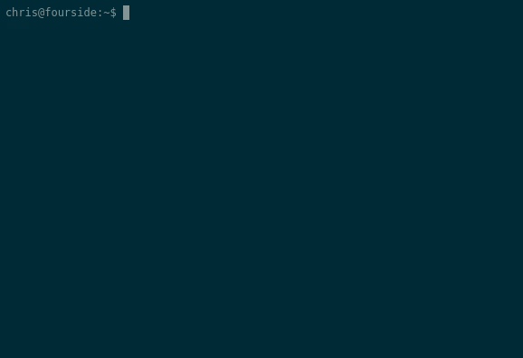

[](https://travis-ci.org/chrisallenlane/node-did)
[]()
[]()
[](https://snyk.io/test/npm/node-did)

did
===
A dead-simple, cli-based task journaler. It helps you remember what you _did_!



Installation
------------
`did` can be installed directly from `npm`:

```sh
[sudo] npm install -g node-did
```

Usage
-----
To record an entry:

```sh
did Installed Gentoo.
```

To record an entry using `EDITOR` (will open in the terminal in focus):

```sh
did
```

To view recent entries:

```sh
did log
```

To view recent entries (last 3 only):

```sh
did log -n3
```

To search for entries about Gentoo:

```sh
did log -s gentoo
```

To search for entries about Gentoo between Monday and today:

```sh
did log -s gentoo -f 'last monday' -u 'today'
```

To view the above in ascending order (ie, oldest first):

```sh
did log -s gentoo -f 'last monday' -u 'today' -a
```

To edit entry `2`:

```sh
did edit 2 Hacked the Gibson.
```

To edit entry `2` within `EDITOR`:

```sh
did edit 2
```

To delete entry `2`:

```sh
did delete 2
```

Tagging
-------
`did` provides full-text searching on log entries, and thus implicitly supports
"tagging":

```sh
$ did Installed Gentoo. +work
$ did Freed Kevin. +personal
$ did Hacked the planet. +work 
$ did log -s +personal
3  Freed Kevin. +personal  06 Jan | 05:29 PM
```

You may choose any tagging convention. Note, however, that `#` must be enclosed
within quotations to prevent the shell from parsing it as a comment:

```sh
$ did 'Hacked the planet. #work'
```

Additional Information
----------------------
Additional information can be found in the [wiki][]:

- [Configuring][]

[Configuring]: https://github.com/chrisallenlane/node-did/wiki/Configuring
[Supported Platforms]: https://github.com/chrisallenlane/node-did/wiki/Supported-Platforms
[wiki]: https://github.com/chrisallenlane/node-did/wiki
